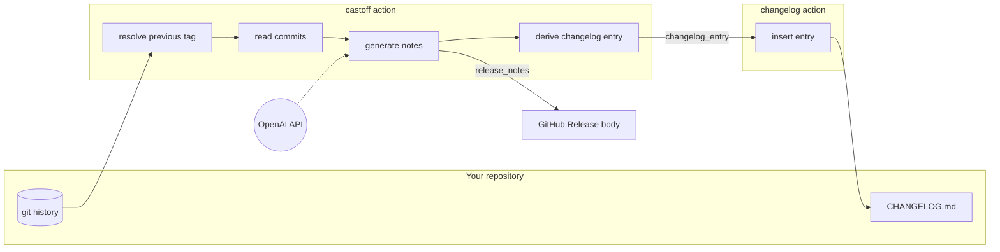
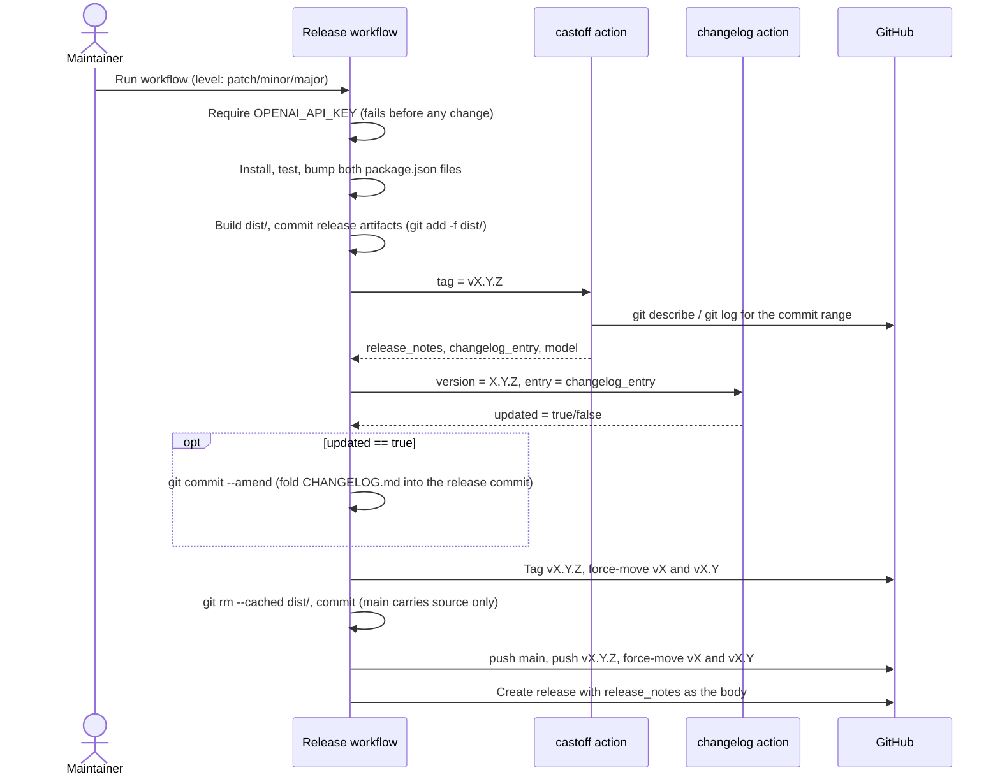
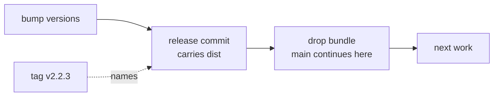
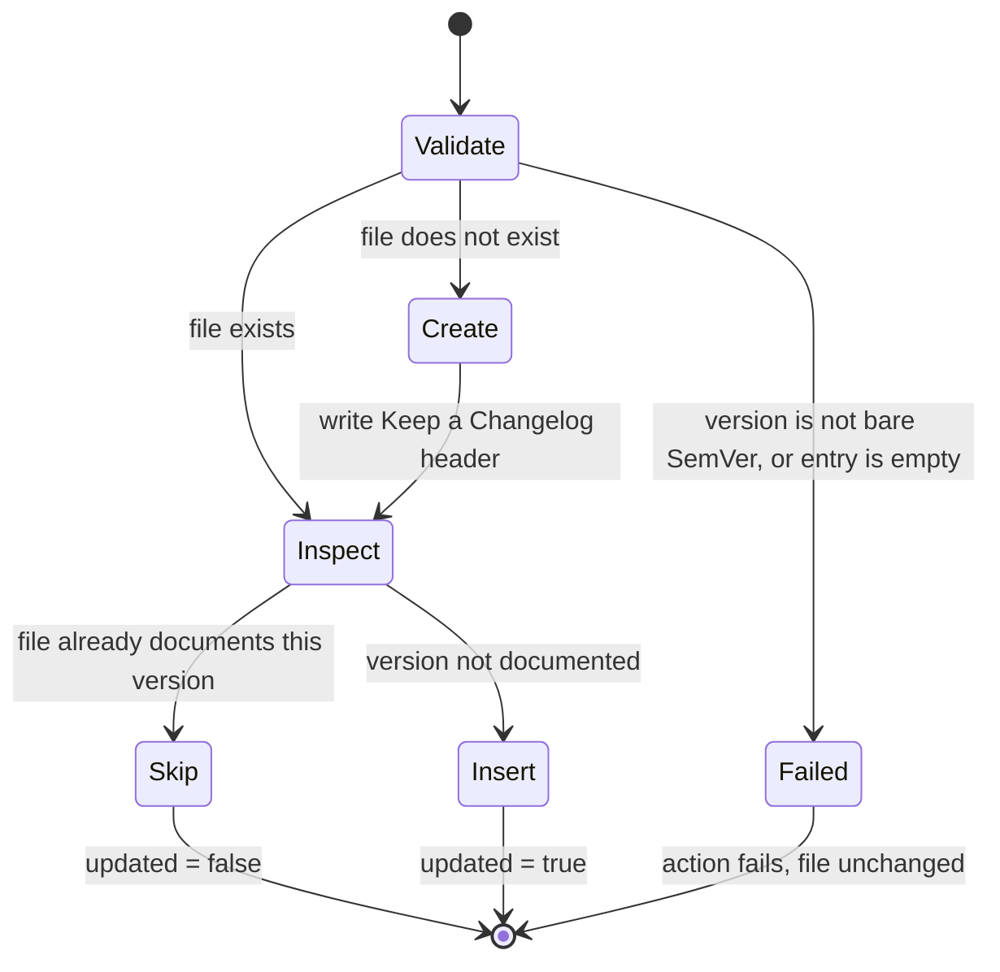

# Architecture

Two actions ship from this repository, from one tag. Neither touches git: they
read inputs, call OpenAI or the filesystem, and set outputs. Staging,
committing, tagging and publishing stay in the calling workflow, which is what
makes the pair usable in release processes that differ from this one.

## How the two actions compose

`castoff/` turns the commits between two tags into release notes, and derives a
Keep a Changelog entry from the same notes. `changelog/` writes that entry into
a file. A workflow can use either one alone.

`release_notes` carries an attribution footer naming the resolved model;
`changelog_entry` is the same content with its sections demoted one level, a
`## [<version>] - <YYYY-MM-DD>` heading on top, and the footer removed so it is
not repeated once per release. The resolved model is also an output in its own
right (`model`), which is how the E2E matrix asserts model selection.

Previous-tag resolution is the part worth knowing about: `git describe` runs
first with the repository's floating tags excluded, so a release lands against
the preceding _version_, not against the `vN` or `vN.M` tag sitting on the same
commit. If that finds nothing — a repository with no version tags, or a git too
old for `--exclude` — it retries unfiltered, and failing that treats the release
as the first one and reads the whole log.

## The release pipeline

This repository releases itself with its own actions. The ordering is
deliberate: the version bump and the build happen before any notes are
generated, and the changelog is folded into the release commit by amending it,
so the tag carries its own changelog rather than pointing at a commit that
predates it.

The key-presence check is the first step for a reason: it runs before the bump,
the build, the commit and the tag, so a missing secret leaves nothing partial to
clean up. See [Why your release failed](../README.md#why-your-release-failed).

Because `vX` and `vX.Y` are force-moved on every release, both floating tags
always name a real published version — and because `castoff` excludes them when
resolving the previous tag, moving them does not corrupt the next release's
commit range.

## Where the bundle lives

GitHub Actions runs `dist/index.js` straight from whatever ref a consumer
references — there is no build step on their side — so every published tag has
to carry the bundle. It does not have to be on `main`, and it is not: `dist/` is
gitignored, built locally with `pnpm build` and in CI for the tests, and
committed only by the release workflow.

The release commit carries the bundle and is what the tags name. The commit
straight after it removes the bundle again, and that is what `main` ends on. The
tagged commit therefore stays an _ancestor_ of `main`, which matters more than it
looks: the action resolves the previous release with
`git describe --tags --abbrev=0 HEAD^`, an ancestry walk (ADR-005). Parking the
bundle on a release branch instead would put every tag off `main`, and each
release would fail to find its predecessor and summarize the whole history.

What this buys: ncc inlines runtime dependencies, so a committed bundle goes
stale on every dependency bump. With the bundle out of `main`, a Dependabot PR
touches the manifest and lockfile only, and nothing has to rebuild or verify a
generated file under review. The trade is one bookkeeping commit per release,
which shows up in the next release's commit range.

## What the changelog writer decides

The writer is safe to rerun, which matters when a release fails after the
changelog step. Rerunning a release that already wrote its entry is a no-op
rather than a duplicate.

`Insert` places the entry above the newest released heading and below an
`## [Unreleased]` section when the file has one. The write goes to a staging
file that inherits the target's mode and is then renamed over it, so an
interrupted run leaves the original intact and leaves no staging file behind.
Validation happens before anything is written, so a rejected input never
produces a half-edited changelog.
